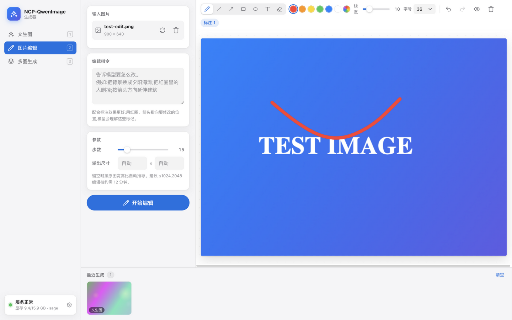

# NCP-QwenImage 生成器

基于 Qwen-Image-2.1 局域网 API 的图像工作台，macOS Apple 风格界面。支持 **文生图**、**图片编辑（Canvas 标注）**、**多图生成（Canvas 标注）** 三种模式，零依赖、免构建。



## 快速开始

```bash
# 方式一:双击 start.command

# 方式二:命令行
cd QwenImage
python3 server.py
```

打开 **http://127.0.0.1:8300** 即可使用。局域网内其他设备（如 iPad）可用启动日志中打印的局域网地址访问。

- API 服务器地址与密钥：点左下角服务状态卡片进行配置（默认 `http://192.168.31.30:8100`，若设置了 `QWEN_API_KEY` 则填密钥），保存前可「测试连接」。
- 所有请求经本机网关（`server.py`）转发，浏览器无需任何 CORS 配置。

### Mock 演示模式

GPU 服务器不在线时也能完整体验界面与流程：

```bash
WB_MOCK=1 python3 server.py
```

Mock 会返回程序生成的渐变图，其余交互（参数、标注、历史、灯箱）与真实模式完全一致。结果文件名会编码参数（如 `mock-edit-2img-s15-seed….png`）方便核对。

## 三种模式

### 1. 文生图
- 提示词中文直接输入
- **画面尺寸 = 比例 × 分辨率**：比例 1:1 / 4:3 / 3:4 / 16:9 / 9:16；分辨率 1K / 2K，或自定义（256–2048，对齐 32 倍数，可交换宽高）。卡片标题实时显示计算后的输出像素
- 数量 1–4 张、步数、种子（留空随机，固定可复现）
- 高级参数：负向提示词 + 引导强度、透明背景（RGBA）

### 2. 图片编辑（带标注）
- 拖入 / 选择 / ⌘V 粘贴图片
- **Canvas 标注工具**：画笔、直线、箭头、矩形、椭圆、文字、橡皮；6 种颜色 + 自定义；线宽与字号可调；支持撤销 / 重做 / 清空 / 显隐预览
- 标注会合成进图片一并发送——Qwen-Image 支持理解图上的红圈、箭头等指引标记（建议用**红色 + 较粗线**圈出要改的位置，配合文字指令效果最好）
- 输出比例支持「原图」（按已载入图片推导）或固定比例；编辑建议 1K，2K 档约需 12 分钟

### 3. 多图生成（带标注）
- 最多 10 张参考图（可拖拽 / 多选 / 粘贴），用于人物、商品一致性
- 点击缩略图切换，**每张图单独标注**（切换时标注各自保留，列表上有蓝点提示）
- 可调整参考顺序；输出比例「原图」按**最后一张**参考图推导

### 通用能力
- **历史记录**：底部最近生成栏（本地保留 60 条元数据），点击打开灯箱查看大图与参数，可下载、去编辑、加入多图、复制提示词
- **任务遮罩**：生成中显示已用时长与队列状态；「停止等待」仅停止前端等待，服务器任务仍会完成
- 快捷键：`1/2/3` 切换模式，`B/L/A/R/O/T/E` 切换标注工具，`⌘Z / ⇧⌘Z` 撤销重做，`Esc` 关闭弹层
- 参数表单自动记忆（localStorage）

## 注意事项（来自 GPU 服务器实测）

| 事项 | 说明 |
|---|---|
| 单卡串行 | 同时只执行一个任务，前端一次也只发一个；其余排队（上限 4） |
| 耗时参考 | 文生图 1024²/20 步约 30s；2048²约 70s；编辑 1024 约 60s；**2048 编辑约 12 分钟**，建议编辑用 ≤1024 再放大 |
| 停止等待 | 取消的只是前端等待，GPU 上的任务会跑完并可从历史取回 |
| 结果保存 | 图片存于 GPU 服务器 `outputs/`，服务器重启后历史缩略图会失效（界面会显示占位提示） |
| 复现 | 相同 seed + 相同参数可复现（SageAttention 开关变化会改变输出） |

## 结构

```
QwenImage/
├── server.py          # 本地网关:静态服务 + /p?url=… API 反向代理 + Mock
├── start.command      # macOS 双击启动
└── public/
    ├── index.html     # 页面(含 SVG 图标库)
    ├── app.css        # Apple 风格样式
    └── js/
        ├── api.js     # API 客户端(经网关转发,处理 b64/url 双格式)
        ├── annotator.js # Canvas 标注引擎(矢量标注、撤销栈、原分辨率合成)
        ├── util.js    # 工具函数
        └── main.js    # 主逻辑(模式、任务、历史、灯箱、设置、快捷键)
```

## 常见问题

- **左下角显示「无法连接」**：确认 GPU 服务器已启动（`/health` 返回 ready）、本机与其在同一局域网；若服务器 IP 变了，点状态卡片改地址。路由器更换后网段可能不同（如 `192.168.31.x` → `192.168.1.x`）。
- **状态灯说明**：直接映射服务器 `phase` 字段——空闲显示「服务正常」，`encoding`/`denoising` 等阶段显示「编码中」「去噪中」（本机有任务时琥珀色呼吸灯；无任务但服务器在忙说明其他客户端在执行，显示「忙碌」）。队列计数取自 `queued` 字段，接近上限（≥3）时警示。
- **步数上限 40**：按部署要求限制，三处步数滑杆最大值均为 40（服务器本身允许 1–100，API 直调不受此限）。
- **端口冲突**：默认 8300，被占用时自动顺延（8300–8319），也可 `python3 server.py 8400` 指定。
- **需要 Node 吗**：不需要，纯 Python 标准库 + 原生 HTML/JS。
